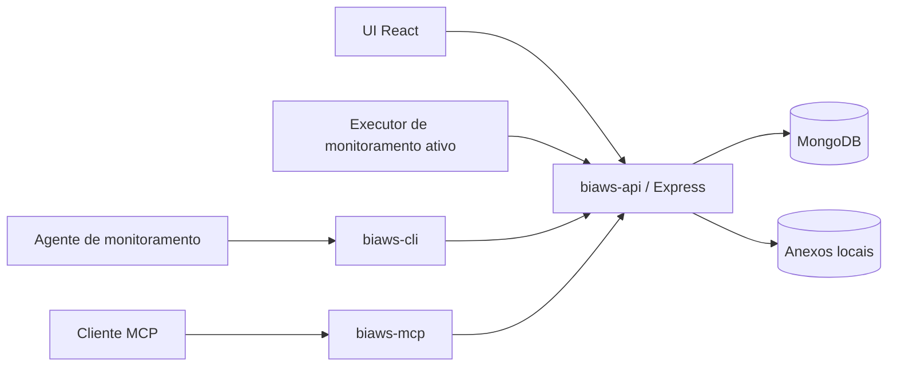

# Bondia Workspaces

**A camada operacional do harness para pessoas e agentes operarem e evoluírem software.**

O Bondia Workspaces (`biaws`) é uma plataforma open source e agent-native que
conecta trabalho, conhecimento, topologia e sinais operacionais. Pessoas usam a
interface web; agentes autorizados acessam o mesmo contexto por ferramentas de
domínio, com identidade, escopo e auditoria.

> **Status:** alpha (`0.x`). O projeto é adequado para avaliação, demonstração e
> desenvolvimento local. Ainda não há garantia de compatibilidade entre versões
> nem recomendação para dados críticos de produção.

**Nomenclatura:** a marca apresentada às pessoas é **Bondia Workspaces**. Código,
comandos, banco de dados, containers e outros identificadores técnicos usam a
sigla curta `biaws`.

Para começar, escolha a rota do seu sistema no [QUICKSTART](QUICKSTART.md) ou
[entregue a instalação ao seu agente](docs/agent-assisted-installation.md) com
um único prompt.


<table>
  <tr>
    <td></td>
    <td></td>
  </tr>
  <tr>
    <td></td>
    <td></td>
  </tr>
</table>

As telas usam o workspace fictício **Athena Tek**, uma pequena software house
operando três aplicações de clientes. Nenhum endereço, cliente ou dado exibido
representa um ambiente real.

## Por que uma camada de harness operacional?

Um agente é tão útil quanto o contexto, as ferramentas e os limites oferecidos
ao seu redor. Na prática, essas informações costumam ficar separadas entre
chamados, documentos, inventários, dashboards e o conhecimento tácito da equipe.

O BIAWS transforma esse material em uma camada operacional compartilhada:

- **contexto:** chamados, melhorias, tarefas, procedimentos, regras e decisões;
- **mapa:** aplicações, componentes, repositórios, integrações, servidores,
  deployments e runtimes;
- **sinais:** histórico passivo e idempotente da saúde dos runtimes;
- **guardrails:** workspaces, identidades, grupos, permissões, escopo por
  aplicação, cofre criptografado e auditoria;
- **ferramentas:** operações estruturadas via MCP, CLI e skills versionadas.

O projeto não orquestra modelos nem executa agentes. Ele fornece a camada de
contexto e controle que clientes como Codex, Claude e outros agentes compatíveis
podem usar para trabalhar sobre sistemas reais.

## Use o agente que você já assina

O BIAWS não chama diretamente a API de um provedor de modelos e não exige uma
`OPENAI_API_KEY` ou `ANTHROPIC_API_KEY`. Ele executa um servidor MCP que oferece
contexto e ferramentas ao cliente escolhido pelo usuário. Não há, portanto, um
token de modelo entregue à plataforma para ficar disponível a automações em
segundo plano ou fluxos desconhecidos.

Quem já usa o Codex com um plano ChatGPT elegível ou o Claude Code autenticado
por uma assinatura Pro ou Max pode conectar o MCP do BIAWS e operar dentro do
uso incluído no próprio plano, sem contratar cobrança de API separada apenas
para acessar a plataforma. O Codex e o Claude Code documentam oficialmente o
uso por assinatura e a conexão com servidores MCP:

- [Codex com um plano ChatGPT](https://help.openai.com/pt-br/articles/11369540-using-codex-with-your-chatgpt-plan)
  e [configuração MCP no Codex](https://developers.openai.com/codex/mcp/);
- [Claude Code com Pro ou Max](https://support.claude.com/en/articles/11145838-use-claude-code-with-your-pro-or-max-plan)
  e [configuração MCP no Claude Code](https://docs.anthropic.com/en/docs/claude-code/mcp).

O uso continua sujeito aos limites da assinatura escolhida. Créditos extras,
pay-as-you-go ou upgrades só entram em cena quando o próprio usuário decide
ultrapassar esses limites. A chave técnica criada pelo setup autentica o MCP no
BIAWS local; ela não é um token faturável do provedor do modelo.

## Como o harness se organiza

| Camada                 | O que o BIAWS oferece                                                                  |
| ---------------------- | -------------------------------------------------------------------------------------- |
| Trabalho               | Chamados, melhorias, tarefas, prazos, checklists, anexos e jornadas                    |
| Conhecimento           | Procedimentos e documentos tipados em Markdown                                         |
| Topologia              | Aplicações, componentes, repositórios, integrações, servidores, deployments e runtimes |
| Observação             | Sinais externos de saúde, metadados operacionais e relação com procedimentos           |
| Controle               | Tenancy, permissões, escopo por aplicação, segredos e trilha de auditoria              |
| Interface para agentes | MCP com ferramentas de domínio, CLI e catálogo de skills                               |

## Comece pelo contexto que já existe

O primeiro inventário não precisa começar em um formulário. O catálogo inicial
inclui skills de descoberta que ajudam o modelo a ler evidências já presentes no
projeto, comparar o resultado com o BIAWS e propor um mapa para revisão:

| Skill                              | O que descobre                                            | Fontes típicas                                         |
| ---------------------------------- | --------------------------------------------------------- | ------------------------------------------------------ |
| `$biaws-discover-application`      | Aplicações, componentes, repositórios e integrações       | Código, manifests de pacotes, contratos e documentação |
| `$biaws-discover-infrastructure`   | Servidores, deployments, runtimes e relações de topologia | Docker, Kubernetes, IaC, CI/CD e runbooks              |
| `$biaws-discover-secret-inventory` | Nomes, escopos, consumidores e referências de segredos    | Templates de ambiente, schemas, manifests e workflows  |

As descobertas são baseadas em evidências e funcionam em modo de proposta por
padrão. O agente mostra fontes, confiança, correspondências e lacunas; a equipe
revisa as diferenças antes de autorizar o registro via MCP. No inventário de
segredos, valores reais nunca são lidos nem enviados ao BIAWS — somente
metadados e referências seguras.

Depois do setup, por exemplo, peça ao agente:

```text
Use $biaws-discover-application para mapear este repositório no workspace,
mas apresente a proposta e as evidências antes de registrar qualquer mudança.
```

## Destaques

- home pessoal baseada em um catálogo expansível de widgets configuráveis;
- chamados com importação EML, anexos, filtros, indicadores e taxonomia;
- melhorias com especificação Markdown, tarefas, checklist, prazos e acompanhamento de jornadas;
- procedimentos organizados em coleções, classificados pela mesma taxonomia e
  associáveis a runtimes;
- documentos tipados em Markdown — regras, decisões, guidelines, features e referências técnicas — com coleções,
  contexto de aplicação, componentes, revisões e referências estruturadas;
- workspaces e aplicações como fronteiras de organização e autorização;
- componentes, repositórios, servidores, deployments e runtimes com consultas
  reversas e contexto agregado;
- recepção passiva e idempotente de sinais externos de saúde dos runtimes, com
  apresentação estruturada dos metadados;
- autenticação, chaves de API, grupos e permissões;
- cofre local para textos e arquivos secretos reversíveis, com versões criptografadas e chave
  mestra separada;
- trilha de auditoria funcional;
- servidor MCP com ferramentas de catálogo, topologia, issues, melhorias,
  procedimentos, conhecimento, coleções e metadados de segredos;
- CLI público para instalar e administrar a plataforma, manter perfis de acesso,
  associar projetos a workspaces, operar recursos de domínio e configurar agentes e skills;
- UI React responsiva e acessível;
- MongoDB e armazenamento local de anexos, com contrato preparado para outros
  providers.

## Arquitetura



Detalhes de responsabilidades e fluxos estão em
[docs/architecture.md](docs/architecture.md).

## Instalação

O comando `biaws` é a interface pública para instalação, administração e uso da
plataforma. O runtime da API, UI, MongoDB e executor continua usando Docker
Compose; o CLI administra esses assets e também configura o projeto no qual o
agente será executado.

```bash
npm install --global biaws
biaws --help
```

Os comandos se organizam em três níveis:

```text
biaws admin ...      # instala e administra instâncias e executores
biaws config ...     # mantém perfis, URLs e credenciais globais do CLI
biaws workspace ...  # associa a pasta e opera recursos do workspace
```

Quem apenas consumirá um servidor existente precisa somente de Node.js, do CLI
e de uma chave individual. Quem hospedará uma instância também precisa dos
assets completos de uma release ou checkout, além de Git, Docker Compose, Bash,
OpenSSL e `curl`.

Estas são as plataformas oficialmente documentadas:

| Ambiente | Rota suportada                                                        |
| -------- | --------------------------------------------------------------------- |
| macOS    | Bash + Docker Desktop                                                 |
| Linux    | Bash + Docker Engine ou Docker Desktop                                |
| Windows  | WSL2 + uma distribuição Linux + integração do Docker Desktop          |
| Agente   | Um único prompt; o agente detecta o sistema e executa esta mesma rota |

Windows nativo, PowerShell, Prompt de Comando, Git Bash, MSYS2 e Cygwin não são
ambientes de execução suportados. No Windows, clone o repositório e mantenha os
dados dentro do filesystem do WSL2, não em `/mnt/c`.

As instruções de instalação dos pré-requisitos para cada sistema e o fluxo
completo estão no [QUICKSTART](QUICKSTART.md). Se você já usa Codex, Claude Code
ou outro agente com terminal, copie o
[prompt de instalação assistida](docs/agent-assisted-installation.md): o agente
poderá instalar o BIAWS sem pedir que você digite comandos, solicitando apenas
as aprovações necessárias.

O CLI configura o MCP como `npx --yes biaws-mcp@<versão>`, portanto o projeto
consumidor não precisa clonar a plataforma. Operações administrativas precisam
da raiz que contém `compose.yaml`, `docker/`, `scripts/` e os módulos da
plataforma. Informe-a por `--root` ou `BIAWS_ROOT`. Em um checkout de
desenvolvimento, `npm --prefix biaws-cli link` expõe o mesmo comando.

### Pré-requisitos

Para o CLI e um cliente remoto:

- Node.js `20.19.0` ou superior;
- acesso HTTPS à API da instância.

Para hospedar ou desenvolver a plataforma, acrescente:

- Git e Bash;
- Docker com o plugin Compose;
- `curl`, `openssl` e `tar`.

Valide o ambiente antes do primeiro setup:

```bash
./scripts/check-prerequisites.sh --include-git
```

### Instância local

Para avaliação ou desenvolvimento individual, obtenha os assets da plataforma,
instale o CLI e crie a instância pelo assistente:

```bash
git clone https://github.com/fbondia/biaws.git
cd biaws
npm install --global biaws
biaws admin doctor
biaws admin instance setup --root "$PWD" --interactive
```

O setup mostra um plano antes de alterar arquivos ou iniciar containers. Ele
cria a configuração da instância, seleciona as portas, gera os segredos,
constrói e inicia os serviços, cria o administrador e as identidades técnicas e
publica o catálogo inicial de skills.

As portas `4400`, `3100` e `27017` são apenas os defaults da primeira instância.
Consulte os endereços efetivos com:

```bash
biaws admin instance show meu-projeto --root "$PWD"
biaws admin instance status meu-projeto --root "$PWD"
```

A senha inicial fica em
`instances/meu-projeto/.bootstrap-admin-password`, ignorado pelo Git. Troque-a
pela UI no primeiro acesso. A chave técnica fica somente no `.env` privado da
instância e não é exibida no resumo.

No projeto consumidor, configure o cliente usando esse arquivo privado:

```bash
cd /caminho/do/projeto
biaws workspace agent configure codex \
  --env-file /caminho/para/biaws/instances/meu-projeto/.env \
  --workspace id-do-workspace
biaws workspace agent doctor codex \
  --env-file /caminho/para/biaws/instances/meu-projeto/.env \
  --workspace id-do-workspace
```

Sem `--workspace`, o assistente permite escolher entre os workspaces acessíveis.
A seleção não concede acesso: a identidade precisa ser membro ativo do
workspace.

### Servidor compartilhado

No host dos serviços, obtenha os assets completos e informe a origem HTTPS pela
qual a UI será publicada:

```bash
biaws admin instance setup \
  --root /opt/biaws \
  --name equipe \
  --public-url https://biaws.exemplo.com \
  --interactive
```

Publique UI e API por um proxy HTTPS, encaminhando `/api` para a API. Não exponha
o MongoDB. Em cada máquina cliente, crie um arquivo privado com uma chave
individual:

```dotenv
BIAWS_API_URL=https://biaws.exemplo.com
BIAWS_API_KEY=biaws_chave_individual
```

Na máquina cliente, somente o CLI é necessário. Configure um perfil para
operações diretas e associe o projeto ao workspace:

```bash
chmod 600 ~/.config/biaws/equipe.env
biaws config init --api-url https://biaws.exemplo.com
cd /caminho/do/projeto
biaws workspace init id-do-workspace
biaws workspace agent configure codex \
  --env-file ~/.config/biaws/equipe.env \
  --workspace id-do-workspace
```

Veja os requisitos de proxy, credenciais e isolamento em
[docs/shared-server.md](docs/shared-server.md).

### Operação e opções

Inicie, pare, atualize e proteja a instância com o CLI:

```bash
biaws admin instance start meu-projeto --root /caminho/para/biaws
biaws admin instance stop meu-projeto --root /caminho/para/biaws
biaws admin instance update meu-projeto --root /caminho/para/biaws --check
biaws admin instance backup meu-projeto --root /caminho/para/biaws
```

Para remover uma instância, incluindo containers, rede, volumes Docker e seu
diretório local:

```bash
biaws admin instance remove meu-projeto --root /caminho/para/biaws
```

Bind mounts configurados fora do diretório da instância são preservados por
padrão. Use `--delete-external-data` somente quando também quiser apagar esses
dados de forma definitiva.

Para migrar uma instância completa, incluindo MongoDB, anexos, documentos,
cofre, chave mestra e configuração sensível, gere um pacote criptografado:

```bash
biaws admin instance backup meu-projeto --root /caminho/para/biaws
```

No host de destino, crie primeiro uma instância com os caminhos, portas e URL
corretos e restaure o pacote:

```bash
biaws admin instance restore meu-projeto \
  --root /caminho/para/biaws \
  --archive /caminho/meu-projeto-<data>.tar.gz.enc
```

Os comandos solicitam a senha sem expô-la na linha de comando. Para automações,
use `--password-file` com um arquivo protegido por permissão `0600`.

O backup lógico do MongoDB recebe timestamp e checksum SHA-256. O restore
confere o checksum, quando presente, e solicita confirmação explícita antes de
substituir o banco da instância.

Para automação não interativa, informe os campos exigidos e mantenha a senha
fora de `argv`:

```bash
BIAWS_BOOTSTRAP_ADMIN_EMAIL=voce@example.com \
BIAWS_BOOTSTRAP_ADMIN_NAME="Seu Nome" \
BIAWS_BOOTSTRAP_ADMIN_PASSWORD="uma-senha-segura-com-12-ou-mais-caracteres" \
biaws admin instance setup \
  --root /caminho/para/biaws \
  --name meu-projeto \
  --defaults --non-interactive --yes
```

Para iniciar sem dados de demonstração:

```bash
biaws admin instance setup --root /caminho/para/biaws \
  --name meu-projeto --no-demo-seed --interactive
```

Liste as instâncias:

```bash
biaws admin instance list --root /caminho/para/biaws
```

O seed nunca apaga registros e não substitui uma taxonomia já existente. Veja
[docs/demo-data.md](docs/demo-data.md).

Atualizações, backup, restauração e diagnóstico estão no
[runbook operacional](docs/operations.md).

## Várias instâncias, uma instalação

Cada instância mantém configuração, credenciais, scripts auxiliares, backups e
configurações de executor em `instances/<nome>`. Código, imagens Docker e CLI
são compartilhados pela instalação. O nome do projeto Compose, os volumes, as
portas, o banco e as chaves técnicas permanecem isolados.

```bash
biaws admin instance setup --root /opt/biaws --name cliente-a --interactive
biaws admin instance setup --root /opt/biaws --name cliente-b --interactive
biaws admin instance list --root /opt/biaws
```

O assistente oferece as portas padrão e valida colisões com as demais
instâncias. Ao criar mais de uma, informe valores distintos com `--mongo-port`,
`--api-port` e `--ui-port`. Sem `--name`, o assistente solicita o nome.

Para repetir somente a configuração do cliente:

```bash
biaws workspace agent configure codex \
  --project /caminho/do/projeto \
  --env-file ~/.config/biaws/cliente-a.env
```

Em um terminal interativo, o CLI solicita o projeto, o arquivo privado da
instância e o workspace por padrão:

```bash
biaws workspace agent configure codex
```

Use `--no-interactive` em uma execução manual que já forneça todos os parâmetros.

O MCP recebe `BIAWS_ENV_FILE` e `BIAWS_WORKSPACE_ID` na configuração local do
projeto. O primeiro aponta para as credenciais e a URL da instância; o segundo
fixa a fronteira de workspace daquele projeto. Para operações diretas do CLI,
`biaws config init` mantém URL e credencial em arquivos globais separados, e
`biaws workspace init` grava somente perfil e workspace em `.biaws/config.json`.
Codex usa `.codex/config.toml`; Claude Code usa `.mcp.json`.

Os scripts em `scripts/` e os atalhos gerados em `instances/<nome>` permanecem
disponíveis para compatibilidade e diagnóstico de baixo nível. O
[runbook operacional](docs/operations.md) documenta quando usá-los.

O cliente pode solicitar aprovação para usar um servidor MCP definido pelo
projeto. Confirme o pacote e a versão fixada antes de aprovar.

## Desenvolvimento local

O runtime mínimo suportado é Node.js `20.19.0`; Node.js 22 LTS é recomendado.
Copie `.env.example` para `.env`, configure MongoDB e um segredo com pelo menos
32 caracteres.

API:

```bash
cd biaws-api
npm ci
npm run bootstrap:admin
npm run dev
```

UI:

```bash
cd biaws-ui
npm ci
npm run dev
```

Validações:

```bash
cd biaws-api && npm run check && npm test
cd biaws-ui && npm run check:css && npm test && npm run build
cd biaws-mcp && npm run check && npm test
cd biaws-cli && npm run check && npm test
cd biaws-monitor-executor && npm run check && npm test
```

## MCP e CLI

O bootstrap preenche URL e chave no `.env` da instância. Para uma configuração
manual do CLI, crie uma chave na área da conta e defina:

```bash
export BIAWS_API_URL=http://127.0.0.1:3100
export BIAWS_API_KEY=biaws_sua_chave
export BIAWS_WORKSPACE_ID=id-do-workspace
```

Na configuração MCP, mantenha `BIAWS_ENV_FILE` apontando para o `.env` privado
da instância ou do cliente e grave `BIAWS_WORKSPACE_ID` no bloco `env` do
servidor `biaws`. `biaws workspace agent configure codex|claude` faz isso e
instala as skills disponíveis no workspace.

Servidor MCP pelo pacote publicado:

```bash
npx --yes biaws-mcp@0.8.0
```

CLI:

```bash
biaws workspace skills list
biaws workspace skills status
biaws workspace agent doctor codex --project /caminho/do/projeto --workspace id-do-workspace
biaws workspace monitoring signal <aplicação.componente.deployment.runtime> --status healthy --source synthetic-http
```

Consulte [biaws-mcp/README.md](biaws-mcp/README.md) e
[biaws-cli/README.md](biaws-cli/README.md) para o catálogo completo. O contrato
de ingestão está em [docs/monitoring.md](docs/monitoring.md).

## Projeto e comunidade

- [Status, releases e suporte](docs/project-status.md)
- [Arquitetura](docs/architecture.md)
- [Documentos de conhecimento](docs/knowledge.md)
- [Guidelines de desenvolvimento](docs/guidelines/INDEX.md)
- [Operação e recuperação](docs/operations.md)
- [Operação do monitoramento ativo](docs/active-monitoring-operations.md)
- [Índices e performance](docs/performance.md)
- [Como contribuir](CONTRIBUTING.md)
- [Política de segurança](SECURITY.md)
- [Código de conduta](CODE_OF_CONDUCT.md)
- [Changelog](CHANGELOG.md)

Relatos de vulnerabilidade não devem ser publicados em issues. Use o fluxo
descrito em [SECURITY.md](SECURITY.md).

## Licença

Copyright 2026 Fabiano Bondia.

Distribuído sob a [Apache License 2.0](LICENSE).
