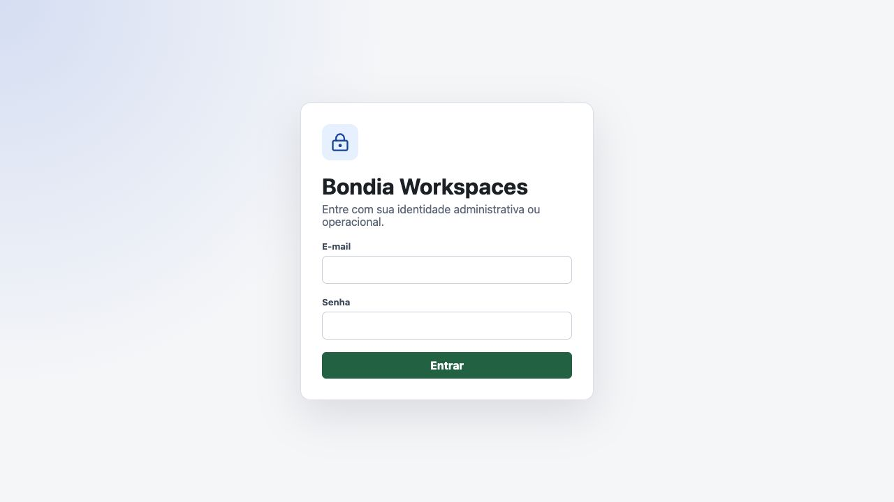
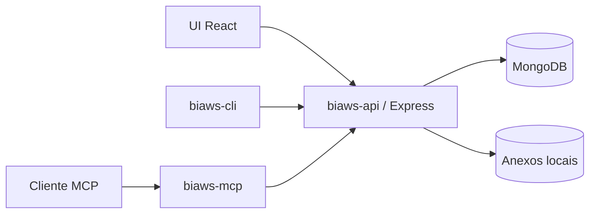

# Bondia Workspaces

Workspace operacional open source para organizar suporte, demandas, procedimentos
e capacidades de agentes em uma única aplicação.

> **Status:** alpha (`0.x`). O projeto é adequado para avaliação, demonstração e
> desenvolvimento local. Ainda não há garantia de compatibilidade entre versões
> nem recomendação para dados críticos de produção.

**Nomenclatura:** a marca apresentada às pessoas é **Bondia Workspaces**. Código,
comandos, banco de dados, containers e outros identificadores técnicos usam a
sigla curta `biaws`.

Para começar pela instalação guiada, consulte o [QUICKSTART](QUICKSTART.md).



## Por que este projeto existe

Ferramentas tradicionais separam o histórico de suporte, a especificação de
melhorias, a base de procedimentos e o contexto consumido por agentes. O Bondia
Workspaces conecta esses elementos e os expõe por interfaces humanas e programáticas.

O principal diferencial é ser **agent-native**: o MCP oferece ferramentas
estruturadas de domínio, e o catálogo de skills permite publicar e instalar
capacidades versionadas sem oferecer acesso genérico ao banco de dados.

## Recursos

- issues de suporte com importação EML, anexos, filtros, indicadores e taxonomia;
- demandas com especificação Markdown, tarefas, checklist, prazos e faturamento;
- procedimentos organizados em coleções e classificados pela mesma taxonomia;
- workspaces e aplicações como fronteiras de organização e autorização;
- componentes, repositórios, servidores, deployments e runtimes com consultas
  reversas e contexto agregado;
- autenticação, chaves de API, grupos e permissões;
- trilha de auditoria funcional;
- servidor MCP com ferramentas de catálogo, topologia, issues, demandas e
  procedimentos;
- CLI para publicar, instalar e atualizar skills;
- UI React responsiva e acessível;
- MongoDB e armazenamento local de anexos, com contrato preparado para outros
  providers.

## Arquitetura



Detalhes de responsabilidades e fluxos estão em
[docs/architecture.md](docs/architecture.md).

## Início rápido com Docker

Pré-requisitos:

- Docker com o plugin Compose;
- Node.js `20.19.0` ou superior;
- `curl` e `openssl`;

Crie ou selecione uma instância e configure o projeto consumidor:

```bash
./scripts/setup-agent.sh \
  --instance meu-projeto \
  --client codex \
  --project /caminho/do/projeto
```

O script:

1. cria `instances/meu-projeto/.env`, se necessário;
2. cria os comandos `instances/meu-projeto/start.sh` e `stop.sh`;
3. seleciona portas livres para o MongoDB, a API e a UI;
4. gera um `BETTER_AUTH_SECRET` local;
5. constrói e inicia MongoDB, API e UI;
6. cria o primeiro administrador;
7. cria uma identidade técnica de menor privilégio para MCP e CLI;
8. publica o catálogo inicial de skills;
9. instala as skills e configura o MCP no projeto consumidor;
10. executa o diagnóstico completo.

Ao final, ele mostra a credencial inicial e os endereços:

- UI: <http://localhost:4400>
- API: <http://localhost:3100>
- MongoDB: `mongodb://127.0.0.1:27017/biaws`
- health check: <http://localhost:3100/api/health>

A senha inicial fica em
`instances/meu-projeto/.bootstrap-admin-password`, ignorado pelo Git. Troque-a
pela UI no primeiro acesso.

A chave técnica fica somente no `.env` da instância, também ignorado pelo Git.
Ela não é exibida no resumo do bootstrap.

Inicie e pare a instância com:

```bash
instances/meu-projeto/start.sh
instances/meu-projeto/stop.sh
```

Para informar sua própria credencial:

```bash
BIAWS_BOOTSTRAP_ADMIN_EMAIL=voce@example.com \
BIAWS_BOOTSTRAP_ADMIN_NAME="Seu Nome" \
BIAWS_BOOTSTRAP_ADMIN_PASSWORD="uma-senha-segura-com-12-ou-mais-caracteres" \
./scripts/setup-agent.sh \
  --instance meu-projeto \
  --client codex \
  --project /caminho/do/projeto
```

Para iniciar sem dados de demonstração:

```bash
BIAWS_SKIP_DEMO_SEED=1 ./scripts/setup-agent.sh \
  --instance meu-projeto \
  --client codex \
  --project /caminho/do/projeto
```

Liste as instâncias:

```bash
./scripts/setup-agent.sh --list-instances
```

O seed nunca apaga registros e não substitui uma taxonomia já existente. Veja
[docs/demo-data.md](docs/demo-data.md).

Atualizações, backup, restauração e diagnóstico estão no
[runbook operacional](docs/operations.md).

## Várias instâncias, um único clone

Cada instância mantém somente configuração e credenciais em `instances/<nome>`.
Código, imagens Docker, MCP e CLI são compartilhados pelo mesmo clone. O nome do
projeto Compose, os volumes, as portas, o banco e a chave técnica permanecem
isolados.

```bash
./scripts/setup-agent.sh \
  --instance cliente-a \
  --client codex \
  --project /projetos/cliente-a

./scripts/setup-agent.sh \
  --instance cliente-b \
  --client claude \
  --project /projetos/cliente-b
```

Portas são alocadas automaticamente para instâncias novas. Use `--mongo-port`,
`--api-port` e `--ui-port` para fixá-las. Sem `--instance`, o script oferece um
seletor em terminais interativos.

Para repetir somente a configuração do cliente:

```bash
./scripts/setup-agent.sh \
  --instance cliente-a \
  --client codex \
  --project /caminho/do/projeto \
  --skip-bootstrap
```

O MCP recebe `BIAWS_ENV_FILE` na configuração do cliente e, por isso, carrega
sempre as credenciais e a URL da instância selecionada. Configurações globais do
cliente não são alteradas. Codex usa `.codex/config.toml`; Claude Code usa
`.mcp.json`.

O cliente pode solicitar aprovação para usar um servidor MCP definido pelo
projeto. Revise o caminho apresentado antes de aprovar.

## Desenvolvimento local

O runtime mínimo suportado é Node.js `20.19.0`; Node.js 22 LTS é recomendado.
Copie `.env.example` para `.env`, configure MongoDB e um segredo com pelo menos
32 caracteres.

API:

```bash
cd biaws-api
npm ci
npm run bootstrap:admin
npm run dev
```

UI:

```bash
cd biaws-ui
npm ci
npm run dev
```

Validações:

```bash
cd biaws-api && npm run check && npm test
cd biaws-ui && npm run check:css && npm run build
cd biaws-mcp && npm run check && npm test
cd biaws-cli && npm run check && npm test
```

## MCP e CLI

O bootstrap preenche estas variáveis no `.env`. Para uma configuração manual,
crie uma chave na área da conta e defina:

```bash
export ISSUE_API_URL=http://127.0.0.1:3100
export ISSUE_API_KEY=biaws_sua_chave
export ISSUE_WORKSPACE_ID=id-do-workspace
```

Servidor MCP:

```bash
node "$PWD/biaws-mcp/src/index.js"
```

CLI:

```bash
node biaws-cli/src/index.js skills list
node biaws-cli/src/index.js skills status
node biaws-cli/src/index.js agent doctor codex --project /caminho/do/projeto
```

Consulte [biaws-mcp/README.md](biaws-mcp/README.md) e
[biaws-cli/README.md](biaws-cli/README.md) para o catálogo completo.

## Projeto e comunidade

- [Status, releases e suporte](docs/project-status.md)
- [Arquitetura](docs/architecture.md)
- [Operação e recuperação](docs/operations.md)
- [Índices e performance](docs/performance.md)
- [Como contribuir](CONTRIBUTING.md)
- [Política de segurança](SECURITY.md)
- [Código de conduta](CODE_OF_CONDUCT.md)
- [Changelog](CHANGELOG.md)

Relatos de vulnerabilidade não devem ser publicados em issues. Use o fluxo
descrito em [SECURITY.md](SECURITY.md).

## Licença

Copyright 2026 Fabiano Bondia.

Distribuído sob a [Apache License 2.0](LICENSE).
