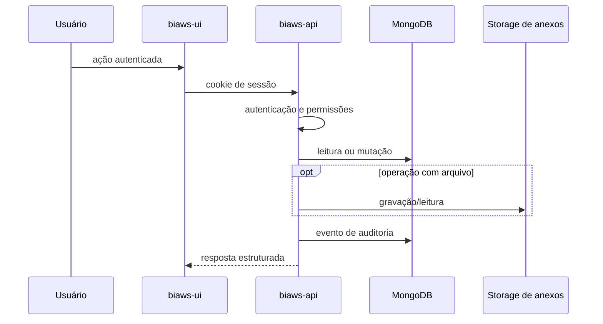

# Arquitetura

## Visão geral

O Bondia Workspaces é um monorepositório leve composto por quatro aplicações Node.js e
um pacote compartilhado.

| Componente | Responsabilidade |
| --- | --- |
| `biaws-api` | HTTP, autenticação, autorização, domínio, auditoria e persistência |
| `biaws-ui` | experiência web React |
| `biaws-mcp` | ferramentas MCP de domínio sobre a API |
| `biaws-cli` | publicação e instalação local de skills |
| `shared` | permissões, constantes e carregamento de ambiente |

## Fluxos

MCP e CLI usam chaves de API e nunca acessam MongoDB diretamente.

## Dados

MongoDB mantém identidades, workspaces, aplicações, topologia, permissões,
issues, melhorias, procedimentos, taxonomia, skills e auditoria. Anexos ficam
fora do documento, referenciados por `provider` e `key`.

Os nomes físicos das coleções são centralizados em
`biaws-api/src/database/collectionNames.js` e seguem `lowerCamelCase` plural.
Modelos do Better Auth usam o prefixo `auth`; vínculos de usuário e workspace
ficam em `workspaceMemberships`.

## Modelo de contexto e tenancy

`workspaceId` é a fronteira primária de isolamento. Aplicações pertencem a um
workspace; componentes, repositórios, deployments e runtimes pertencem a uma
aplicação; servidores pertencem diretamente ao workspace e podem ser
referenciados por runtimes.

Issues e melhorias exigem aplicação. Procedimentos podem ser gerais ao workspace
ou associados a uma aplicação. Tarefas herdam o contexto da melhoria. O contexto
agregado de uma aplicação retorna apenas resumos sanitizados e limita cada
coleção a 100 itens.

Grupos são vinculados por workspace e podem ter escopo integral ou uma lista de
aplicações. O backend deriva o escopo efetivo por permissão e ignora filtros de
workspace/aplicação enviados pelo cliente quando eles conflitam com a
autorização. Recursos fora do escopo são apresentados como inexistentes.

O provider `local` é o único implementado. Em produção distribuída, implemente
um provider de object storage e uma política de backup antes de escalar
horizontalmente.

## Fronteiras de segurança

- somente health check e operações públicas necessárias do Better Auth dispensam
  identidade;
- rotas de negócio exigem sessão ou chave;
- permissões são verificadas no backend;
- MCP expõe operações intencionais de domínio, não consultas genéricas;
- seleção de banco pelo cliente é recusada;
- toda consulta multi-tenant é restringida pelo workspace resolvido no servidor;
- `.env`, dados e credenciais de bootstrap ficam fora do Git.

## Limitações atuais

- não há onboarding/convite self-service para múltiplos workspaces;
- auditoria síncrona sem transação/outbox comum à mutação;
- storage local;
- contratos HTTP sem OpenAPI versionada;
- a UI ainda não possui uma suíte E2E automatizada.

Essas limitações são aceitáveis para uso local e avaliação alpha, mas devem ser
tratadas antes de uso com dados críticos ou como SaaS público.

Consulte também o [runbook operacional](operations.md) e a revisão de
[índices e planos](performance.md).
