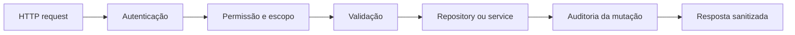

# API e dados

Esta guideline cobre rotas Express, repositories MongoDB, services, índices,
storage e mudanças de dados.

## Fluxo de uma operação

Cada etapa pode ser simples, mas não deve ser omitida implicitamente.

## Rotas

Uma rota deve:

- declarar a permissão necessária antes do handler;
- derivar filtros pelo escopo autorizado, não confiar no workspace do payload;
- validar formato e presença de dados na borda apropriada;
- delegar persistência e invariantes ao repository/service;
- usar status HTTP consistente;
- registrar auditoria após mutação bem-sucedida;
- deixar erros inesperados chegarem ao error handler global.

Convenções de status:

| Situação                           | Status                                        |
| ---------------------------------- | --------------------------------------------- |
| leitura ou atualização concluída   | `200`                                         |
| criação efetiva                    | `201`                                         |
| payload ou parâmetro inválido      | `400` ou `422`, conforme o contrato existente |
| identidade ausente/inválida        | `401`                                         |
| identidade sem permissão           | `403`                                         |
| recurso ausente ou fora do escopo  | `404`                                         |
| conflito de unicidade/concorrência | `409`                                         |
| corpo ou arquivo acima do limite   | `413`                                         |
| falha inesperada                   | `500` sanitizado                              |

Não exponha stack, causa interna, query ou detalhes de storage na resposta.

## Erros

Enquanto o projeto usar `Error` com propriedades adicionais:

- use `statusCode` para o status HTTP;
- use `code` quando o consumidor precisar distinguir o erro;
- escreva mensagens públicas acionáveis, sem dados sensíveis;
- preserve a exceção original como `cause` ao encapsular falhas;
- não capture um erro apenas para retornar um valor ambíguo.

Evite criar helpers locais equivalentes em cada repository. Quando o contrato de
erro exigir novos campos ou comportamento, centralize-o antes de proliferar.

## Repositories

Repositories recebem contexto já autorizado ou suficiente para validar o
escopo. Eles devem:

- normalizar entrada antes de construir a mutação;
- incluir `workspaceId` em consultas multi-tenant;
- validar a relação entre IDs de workspace, aplicação e componente;
- projetar apenas os campos necessários em consultas de suporte;
- aplicar paginação e limite em listagens;
- normalizar `_id`, datas e estruturas BSON na saída pública;
- tratar unicidade e concorrência de forma determinística;
- criar índices idempotentemente.

Funções exportadas devem representar operações de domínio. Helpers de parsing,
normalização e filtros permanecem privados, salvo reuso real e testado.

## Consultas e índices

Toda nova listagem deve definir:

- filtro de tenancy;
- ordenação determinística com desempate por `id`;
- página e limite máximo;
- índice compatível com filtro e ordenação;
- comportamento de itens arquivados;
- metadados de paginação.

Índices compostos multi-tenant começam normalmente por `workspaceId` e, quando
aplicável, `applicationId`. Valide consultas relevantes com
`explain("executionStats")` em uma cópia representativa, seguindo
[`docs/performance.md`](../performance.md).

Não remova um índice apenas por parecer prefixo de outro. Compare planos e uso
antes da alteração.

## Escritas e concorrência

- prefira operações atômicas MongoDB a sequências read-then-write;
- use índice único para invariantes de unicidade;
- converta colisões esperadas em `409` estável;
- use filtro de versão, estado ou timestamp quando houver edição concorrente;
- seeds, bootstrap e sinais repetíveis devem ser idempotentes;
- não faça correção silenciosa de dados fora do agregado alterado.

Quando a mutação e a auditoria não forem transacionais, trate essa limitação
explicitamente. Não prometa atomicidade que a arquitetura ainda não oferece.

## Anexos e storage

- acesse anexos somente por `attachmentStorage` e seu provider;
- valide tamanho, quantidade, nome, tipo e chave;
- impeça path traversal e links simbólicos inesperados;
- aplique autorização antes de ler ou remover o conteúdo;
- persista contexto suficiente para validar workspace/aplicação;
- não armazene conteúdo binário em eventos de auditoria ou logs.

Uma mudança de provider precisa cobrir backup, restore, integridade, exclusão e
execução com múltiplas réplicas.

## Migrações

Scripts de migração devem:

- ter escopo explícito e, quando possível, modo de inspeção/dry run;
- ser repetíveis ou detectar execução anterior;
- registrar contagens, falhas e versão do modelo;
- nunca imprimir documentos completos ou credenciais;
- documentar backup, validação e rollback;
- ser testados em cópia restaurada antes de produção.

## Checklist de nova operação

- [ ] permissão e escopo definidos
- [ ] payload normalizado e limitado
- [ ] consulta inclui tenancy e paginação
- [ ] índice revisado
- [ ] erro público consistente
- [ ] mutação auditada quando aplicável
- [ ] teste positivo e negação de permissão/escopo
- [ ] consumidores e documentação atualizados
