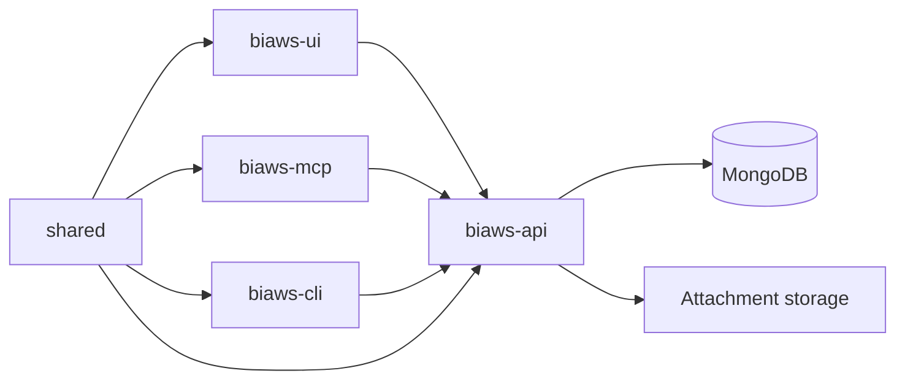

# Fronteiras arquiteturais

O Bondia Workspaces é um monorepositório leve. As fronteiras existem para evitar
que autorização, persistência e contratos de agente se espalhem por toda a base.

## Direção das dependências

Regras:

- UI, MCP e CLI nunca acessam MongoDB ou arquivos persistentes diretamente.
- `shared/` contém contratos portáveis e não importa módulos das aplicações.
- a API não importa código de UI, MCP ou CLI;
- MCP e CLI não contornam a API para obter uma operação mais conveniente;
- chamadas externas e persistência ficam atrás de uma interface com
  responsabilidade identificável.

## Responsabilidade por módulo

### API

- rotas: transporte HTTP, middlewares, status, resposta e auditoria;
- repositories: invariantes de domínio, normalização, consultas e persistência;
- services: orquestração que cruza repositories, parsing ou storage;
- auth: autenticação, resolução de ator, permissão e escopo efetivo;
- storage: contrato e providers de anexos;
- logging: correlação, serialização segura e tratamento global de erros.

Uma rota não deve construir consultas Mongo complexas. Um repository não deve
decidir como uma resposta HTTP será serializada.

### UI

- `api/`: contrato de comunicação HTTP e normalização de erros;
- `components/<domínio>/`: composição visual e interação do domínio;
- `model.js` e utilitários: transformações puras, testáveis sem DOM;
- hooks: estado, efeitos e coordenação da tela;
- `styles/`: foundations, layout, primitives compartilhados e features.

### MCP

- definições de tools descrevem propósito e JSON Schema;
- services validam invariantes locais e traduzem a operação para HTTP;
- `httpClient.js` concentra autenticação, workspace e erros de transporte;
- o protocolo em `src/index.js` não contém lógica de domínio.

### CLI

- `args.js` interpreta argumentos;
- `commands/` implementa cada domínio de comandos;
- `apiClient.js` concentra comunicação HTTP;
- `index.js` seleciona o comando, carrega ambiente e define exit code.

## Contexto e tenancy

`workspaceId` é a fronteira primária de isolamento. `applicationId` restringe o
contexto dentro do workspace quando o domínio exige aplicação.

- o ator autenticado determina o workspace efetivo;
- filtros enviados pelo cliente nunca ampliam o escopo autorizado;
- relações entre aplicação, componente e workspace são validadas no backend;
- tarefas e filhos herdam o contexto do agregado pai;
- recursos fora do escopo devem parecer inexistentes para evitar enumeração.

## Como adicionar um domínio

1. Defina o agregado, sua fronteira de workspace/aplicação e suas permissões.
2. Centralize nomes de coleções e constantes realmente compartilhadas.
3. Implemente normalização e persistência no repository.
4. Adicione índices idempotentes alinhados às consultas.
5. Exponha rotas com autenticação, autorização, limites e auditoria.
6. Adicione o cliente de UI, MCP ou CLI somente se houver consumidor real.
7. Teste a regra de negócio e ao menos uma negação de escopo/permissão.
8. Atualize contrato, arquitetura e operação quando forem afetados.

## Decomposição

Tamanho de arquivo é uma heurística, não uma infração isolada. Considere dividir
um módulo quando ele:

- mistura mais de um agregado ou responsabilidade;
- exige alterações em regiões não relacionadas para uma mudança pequena;
- combina validação, consulta, mutação e apresentação;
- dificulta testes unitários de funções puras;
- expõe um contrato grande sem agrupamento semântico.

Preserve a API pública durante uma refatoração. Prefira módulos como
`normalization.js`, `queries.js`, `mutations.js`, `indexes.js`, `model.js` e
subcomponentes nomeados a divisões baseadas apenas em quantidade de linhas.

## Decisões arquiteturais

Uma mudança que inverte dependências, troca persistência/autenticação, altera a
fronteira de tenancy ou introduz um novo runtime precisa registrar:

- problema e contexto;
- decisão e alternativas consideradas;
- impacto em compatibilidade, segurança e operação;
- plano de migração ou reversão.

Até existir uma pasta formal de ADRs, esse registro pode ficar no documento de
arquitetura relacionado e no pull request.
